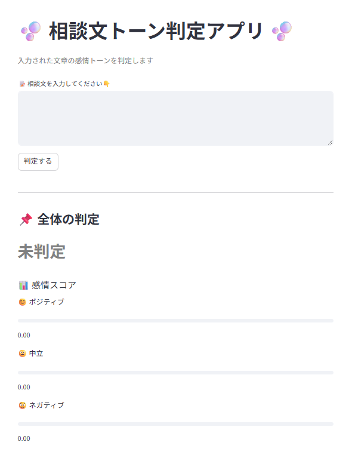
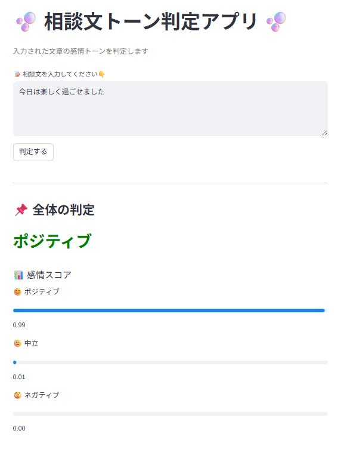
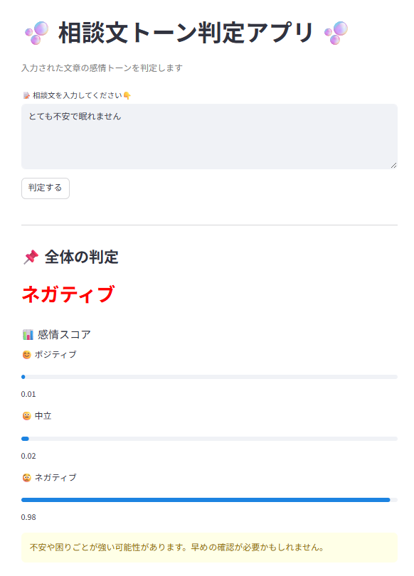
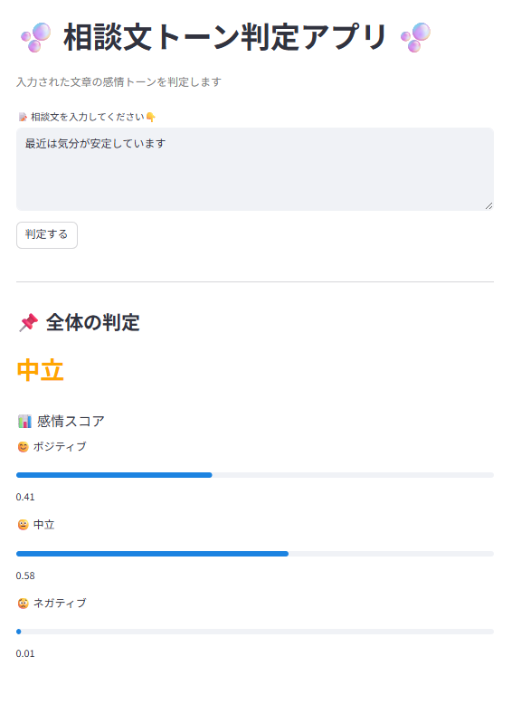

# azure-text-classifier
Text classification app using Azure AI Language

# Azure Text Classification App

## Overview
This is a text classification app using Azure AI Language.
It analyzes input text and categorizes it into predefined labels.

## Screenshots
This app classifies input text into sentiment categories.

| Initial | Positive |
|--------|----------|
|  |  |

| Negative | Neutral |
|----------|---------|
|  |  |

## Features
- Text classification using Azure AI
- Automatic categorization of input data
- Designed for workflow automation and task routing

## Tech Stack
- Python
- Azure AI Language
- REST API

## How to Use
1. Set environment variables for API key and endpoint
2. Run the script
3. Input text to get classification results

## Use Case
This app can be used to automatically classify inquiries and route them to appropriate departments.

## Notes
API keys and endpoints are not included for security reasons.

## Additional Context
This project simulates a system for handling consultation texts and assigning them based on content, inspired by real-world workflow automation needs.
